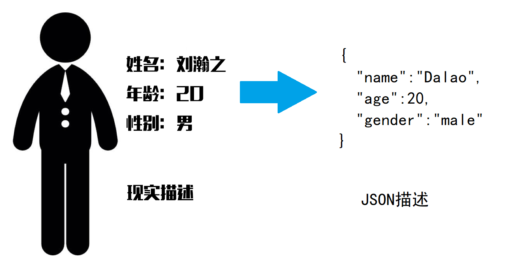
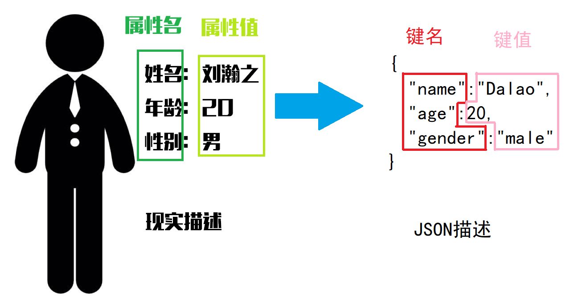

# 什么是JSON
JSON(JavaScript Object Notation, JS 对象简谱) 是一种轻量级的数据交换格式。它基于 ECMAScript (欧洲计算机协会制定的js规范)的一个子集，采用完全独立于编程语言的文本格式来存储和表示数据。简洁和清晰的层次结构使得 JSON 成为理想的数据交换语言。 易于人阅读和编写，同时也易于机器解析和生成，并有效地提升网络传输效率。

# JSON如何表示
这里只介绍部分JSON数据的表示方法
## 1. 如何表示“字符串”
字符串使用双引号括起来，与C语言一样。  
例如字符串“abc”的JSON表示为：  
```json
"abc"
```
## 2. 如何表示“数字”
__本题中出现的所有数字均为整数，可以不考虑浮点数（小数）的情况__
数字不使用双引号括起来，直接从左往右书写接口，与C语言一样。  
例如数字“123”的JSON表示为：  
```json
123
```
## 3. 如何表示“对象”
对象是由多个键值对组成的结构。（相当于C++中的map结构或者Python中的dict结构）  

### 3.1 对象使用大括号表示，以左大括号开始，以右括号结束。
例如一个空对象表示为：  
```json
{
}
```
压缩写法：
```json
{}
```
### 3.2 对象的所有属性使用键值对表示，结构为“键名:键值”
* 属性：对象所具有的特征。例如某个人的姓名是一个属性，某个人的年龄也是一个属性。
* 键值对：由“键名”和“键值”组成的二元结构，总是成对出现。对象的属性总是使用键值对表示的。
* 键名：对象所具有的某个特征的名称。例如某个人的姓名是一个属性，那么这个属性的“键名”是“姓名”。例如某个人的年龄是一个属性，那么这个属性的“键名”是“年龄”。
* 键值：对象所具有的某个特征的结果、数值、或者其他量化表示。例如某个人的姓名是一个属性，这个人名字叫“刘瀚之”，那么这个属性的“键值”是“刘瀚之”。例如某个人的年龄是一个属性，这个人今年20岁，那么这个属性的“键值”是“20”。
* 键值对之间使用逗号分开

### 3.3 键名均为字符串
本问题中，假设键名均为字符串。（实际上JS中也是这样规定的）
### 3.4 键值可以是任何类型，如字符串、数字、对象。
#### 3.4.1 字符串键值
键值类型可以是字符串，例如：
```json
{
    "name": "Finn"
}
```
压缩写法：
```json
{"name":"Finn"}
```
#### 3.4.2 数字键值
键值也可是数字（本问题中假设数字都是整数），例如：
```json
{
    "age": 20
}
```
压缩写法：
```json
{"age":20}
```
#### 3.4.3 对象键值
键值还可以是另一个对象，例如：
```json
{
    "name": "Finn",
    "age": 20,
    "favorite": {
        "type": "Tsundere",
        "name": "Misaka Mikoto"
    }
}
```
压缩写法：
```json
{"name":"Finn","age":20,"favorite":{"type":"Tsundere","name":"Misaka Mikoto"}}
```
#### 3.4.3 数组键值
键值可以是一个数组，数组的定义和写法见4，例如：
```json
{
    "name": "Finn",
    "age": 20,
    "favorite_numbers": [
        2,
        3,
        5,
        7
    ]
}
```
#### 3.4.5 其他
其他类型如函数（方法）等一般与JSON无关。本题也不考虑。
## 4. 如何表示“数组”
数组是由多个元素组成的有序列，使用中括号表示，各个元素之间使用逗号隔开，元素类型可以不同。
### 4.1 空数组
不包含任何元素的数组，例如：
```json
[

]
```
压缩写法：
```json
[]
```
### 4.2 含有一个元素的数组
元素可以为数字（整数），例如：
```json
[
    123
]
```
压缩写法：
```json
[123]
```
元素也可以是字符串，例如：
```json
[
    "Hello"
]
```
压缩写法：
```json
["Hello"]
```
还可以是对象，例如：
```json
[
    {
        "name": "Finn",
        "age": 20
    }
]
```
压缩写法：
```json
[{"name":"Finn","age":20}]
```
甚至是另一个数组，例如：
```json
[
    [
        1,
        2,
        3
    ]
]
```
压缩写法：
```json
[[1,2,3]]
```
### 4.3 含有多个元素的数组
数组元素类型可以不一致，例如：
```json
[
    123,
    "Hello",
    {
        "name": "Finn",
        "age": 20
    },
    [
        1,
        2,
        3
    ]
]
```
压缩写法
```json
[123,"Hello",{"name":"Finn","age":20},[1,2,3]]
```
# 5. 实际应用
例如我们的课程表，实际是以JSON格式传递的，例如（删去了部分数据）：
```json
{
    "datas": {
        "xskcb": {
            "totalSize": 16, 
            "pageSize": 999, 
            "rows": [
                {
                    "ZYDM": "0505", 
                    "JASMC": "外文楼A-404", 
                    "BYBZ": "0", 
                    "JSJC": "2", 
                    "XXXQDM": "1", 
                    "KKDWDM_DISPLAY": "13012000", 
                    "XH": "2176112873", 
                    "KSJC": "1", 
                    "SKZC": "1111111111111111000000000", 
                    "DWDM": "13005000", 
                    "SKJS": "崔延红", 
                    "XM": "董江彬", 
                    "ISTK": 0, 
                    "YPSJDD": "1-16周 星期2 第1-2节 外文楼A-404,2-16周(双) 星期4 第5-6节 外文楼A-404", 
                    "SKXQ": "2", 
                    "XNXQDM": "2017-2018-1", 
                    "JXBID": "201720181ENGL10031238", 
                    "KKDWDM": "13012000", 
                    "KXH": "38", 
                    "BJDM": "2017050502", 
                    "ZCMC": "1-16周", 
                    "KCM": "大学英语III1", 
                    "JASDM": "1009158", 
                    "NJDM": "2017", 
                    "JXLDM": "1009", 
                    "KCH": "ENGL100312"
                }, 
                {
                    "ZYDM": "0505", 
                    "JASMC": "国防中心-国防中心", 
                    "BYBZ": "0", 
                    "JSJC": "6", 
                    "XXXQDM": "1", 
                    "KKDWDM_DISPLAY": "17000000", 
                    "XH": "2176112873", 
                    "KSJC": "5", 
                    "SKZC": "1111111111111111000000000", 
                    "DWDM": "13005000", 
                    "SKJS": "徐宇春", 
                    "XM": "董江彬", 
                    "ISTK": 0, 
                    "YPSJDD": "1-16周 星期2 第5-6节 国防中心-国防中心", 
                    "SKXQ": "2", 
                    "XNXQDM": "2017-2018-1", 
                    "JXBID": "20171MILI10015400-003", 
                    "KKDWDM": "17000000", 
                    "KXH": "03", 
                    "BJDM": "2017050502", 
                    "ZCMC": "1-16周", 
                    "KCM": "国防教育", 
                    "JASDM": "1018069", 
                    "NJDM": "2017", 
                    "JXLDM": "1018", 
                    "KCH": "MILI100154"
                }, 
                {
                    "ZYDM": "0505", 
                    "JASMC": "主楼A-403", 
                    "BYBZ": "0", 
                    "JSJC": "2", 
                    "XXXQDM": "1", 
                    "KKDWDM_DISPLAY": "13005000", 
                    "XH": "2176112873", 
                    "KSJC": "1", 
                    "SKZC": "1010101000000000000000000", 
                    "DWDM": "13005000", 
                    "SKJS": "朱海萍", 
                    "XM": "董江彬", 
                    "ISTK": 0, 
                    "YPSJDD": "1-8周 星期1 第3-4节 主楼A-403,1-8周 星期3 第3-4节 主楼A-403,1-8周(单) 星期5 第1-2节 主楼A-403", 
                    "SKXQ": "5", 
                    "XNXQDM": "2017-2018-1", 
                    "JXBID": "20171COMP30020500-001", 
                    "KKDWDM": "13005000", 
                    "KXH": "01", 
                    "BJDM": "2017050502", 
                    "ZCMC": "1-8周(单)", 
                    "KCM": "程序设计基础", 
                    "JASDM": "1001386", 
                    "NJDM": "2017", 
                    "JXLDM": "1001", 
                    "KCH": "COMP300205"
                }
            ], 
            "extParams": {
                "logId": "0ea6db9b17a548f6b77fd91c09336b5c", 
                "code": 1, 
                "totalPage": 0, 
                "msg": "查询成功"
            }
        }
    }, 
    "code": "0"
}
```
